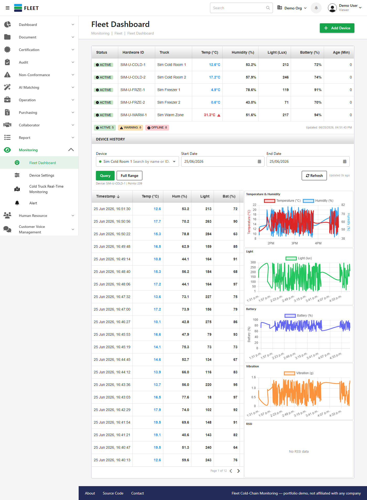

# Fleet Cold-Chain Monitoring

A real-time GPS + temperature/humidity monitoring system for cold-chain delivery trucks — live
sensor dashboards, threshold-based alarms pushed over SignalR, trip tracking, and historical
charting. Built as a full-stack standalone demo: real ASP.NET Core backend, real Postgres
database, real Vue 3 + Quasar frontend.

**🔗 [Live Demo](https://fleet-frontend-3b1t.onrender.com/monitoring/tt19-fleet/dashboard)** — no
login required, opens straight into the dashboard. First load may take ~30-60s if the backend has
been idle (free-tier hosting spins down after inactivity).



## What this is

This started as a feature inside a larger private system and was extracted into a self-contained
project so it can run independently, with its own database, with no dependency on any other
company's infrastructure. The Fleet-specific logic (alarm evaluation, archive-aware queries,
trip scheduling, SignalR push, battery forecasting) is real, working code — not a UI mockup. A
background service (`FleetSimService`) generates realistic synthetic sensor data for 5 simulated
cold-chain devices so the dashboard always has live data to show, with no real hardware required.

The rest of the app's chrome (the full sidebar — Document, Certification, Audit, etc. — and the
top header) mirrors the structure of the original product this was extracted from, but only the
4 Fleet pages are functional. Everything else is intentionally inert UI.

## Tech stack

**Backend:** ASP.NET Core 8, Npgsql, Dapper, SignalR, QuestPDF, JWT auth
**Frontend:** Vue 3, Quasar, Vite, Chart.js, Leaflet, Pinia
**Database:** PostgreSQL (developed against [Neon](https://neon.tech))

## Architecture highlights

- **Real-time alarm push** over SignalR (JWT-authenticated WebSocket), not polling
- **Parallel device polling with a circuit breaker** for resilience against flaky hardware
  connections
- **Partitioned archive tables** for 30-day rolling sensor data, with archive-aware queries so
  "latest reading" lookups never silently return null once data ages out of the hot table
- **A custom SQL migration runner** — versioned, idempotent, embedded-resource-based
- **Battery-life forecasting** via linear regression over recent readings

## Running it locally

**1. Database** — Create a free Postgres instance (e.g. [neon.tech](https://neon.tech)) and grab
its connection string.

**2. Backend**
```bash
cd Backend/HIAS-NET-CORE
```
Create `appsettings.Development.json` (gitignored, never committed) with:
```json
{
  "Database": {
    "ConnectionString": "Host=...;Database=...;Username=...;Password=...;SSL Mode=Require;Trust Server Certificate=true;"
  }
}
```
> Note: Npgsql needs the `Key=Value;` format above, not the `postgresql://...` URI string most
> providers show you by default in their dashboard — convert it before pasting in.

Then:
```bash
dotnet run
```
On first run this applies all schema migrations automatically and starts generating simulated
sensor data. Listens on `http://localhost:5276`.

**3. Frontend**
```bash
cd Frontend
npm install
npm run dev
```
Open the printed local URL and go to `/monitoring/tt19-fleet/dashboard`.

## Status

Deployed and live (see the demo link above) — backend + Neon Postgres + frontend all running on
Render's free tier. Confirmed end-to-end: auth → database → API → live UI, including real-time
alarm push over SignalR.

## License

MIT
